# Главный сервис

Главный сервис - монолитный .NET-сервис для работы с классрумами, задачами и отправками решений.
Он объединяет функциональность прежних `Classrooms Service`, `Task Service` и `Package Service`, но сохраняет асинхронную проверку кода через RabbitMQ и внешний `Run Worker`.

## Цель сервиса

Сервис предоставляет единый API для:

- управления классрумами;
- управления задачами внутри классрумов;
- отправки решений пользователями;
- хранения истории отправок и результатов проверки;
- публикации сообщений с кодом в RabbitMQ;
- приема результатов проверки от воркера;
- разграничения прав между пользователями, ассистентами и администраторами.

Классрумы и задачи могут редактировать пользователи с ролью `Admin` или `Assistant`.
Обычные пользователи могут просматривать доступные классрумы, читать задачи и отправлять решения.

## Общая архитектура

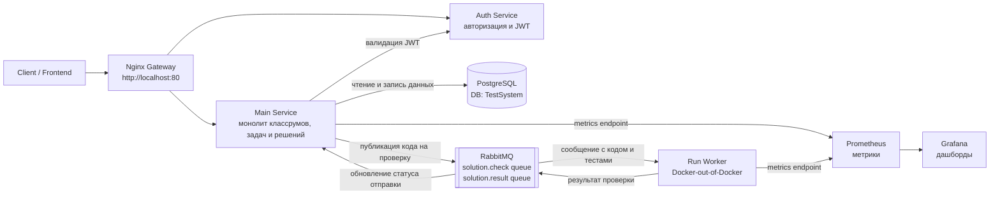

## Границы ответственности

| Компонент | Ответственность |
| --- | --- |
| `Auth Service` | Регистрация, вход, выпуск JWT, хранение пользователей и глобальных ролей в своей БД. |
| `Main Service` | Классрумы, задачи, тесты, отправки решений, статусы проверки, история решений. Не хранит пользователей, использует только `user_id` из JWT. |
| `RabbitMQ` | Асинхронная доставка заданий на проверку и результатов обратно в главный сервис. |
| `Run Worker` | Изолированный запуск пользовательского кода, прогон тестов, расчет результата. |
| `PostgreSQL` | Основное хранилище данных системы. |
| `Nginx` | Единая точка входа и маршрутизация запросов к сервисам. |

## Роли и права доступа

| Роль | Возможности |
| --- | --- |
| `User` | Просмотр доступных классрумов и задач, отправка решений, просмотр своих отправок. |
| `Assistant` | Все возможности `User`, а также создание и редактирование классрумов, задач и тестов в разрешенных классрумах. |
| `Admin` | Полный доступ к созданию, редактированию и удалению классрумов, задач и отправок. |

Проверка прав выполняется в `Main Service` на основании JWT, полученного от `Auth Service`.
Для операций изменения данных сервис проверяет роль пользователя и его связь с классрумом.

## Модель данных

В текущем проекте рядом с `ClassRoom`, `UserClassRoom`, `TaskEntity` и `Package` есть `User`, но в целевой модели монолита эта сущность удаляется из БД главного сервиса.
Пользователи и авторизация принадлежат `Auth Service`.
Главный сервис хранит только `user_id`, полученный из JWT, и использует его как внешний идентификатор пользователя.
В таблицах главного сервиса не должно быть внешних ключей на таблицу пользователей, потому что эта таблица находится в другой базе данных.

- `ClassRoom` остается сущностью классрума;
- `TaskEntity` остается сущностью задачи;
- `Package` остается сущностью отправки решения, то есть аналогом `Submission`;
- `UserClassRoom` остается связью `user_id` из Auth Service с классрумом;
- тесты выносятся из JSON-строки `TaskEntity.Tests` в отдельную таблицу `TaskTest`;
- результат проверки выносится в `PackageResult`, чтобы хранить `passedTests` и `failedTests`, а не только итоговый статус.

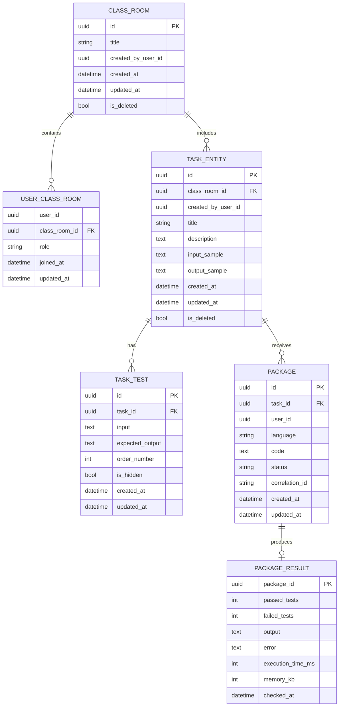

### Описание сущностей

| Сущность | Назначение | Улучшение относительно текущего проекта |
| --- | --- | --- |
| `ClassRoom` | Классрум, в котором находятся задачи и участники. | Добавляются `created_by_user_id`, даты создания/обновления и мягкое удаление. |
| `UserClassRoom` | Связь внешнего `user_id` из Auth Service с классрумом и ролью внутри него. | Роль расширяется до `Student`, `Assistant`, `Teacher`; добавляются даты участия. |
| `TaskEntity` | Задача внутри классрума. | Убирается хранение тестов одной JSON-строкой, добавляются `created_by_user_id`, аудит и мягкое удаление. |
| `TaskTest` | Один тест задачи. | Новая сущность вместо поля `TaskEntity.Tests`; позволяет редактировать, скрывать и сортировать тесты отдельно. |
| `Package` | Отправка решения пользователем. | Хранит внешний `user_id`, добавляются `correlation_id` и `updated_at`; сущность остается центральной для статуса проверки. |
| `PackageResult` | Результат проверки отправки. | Новая сущность для хранения `passed_tests`, `failed_tests`, ошибок и технических метрик запуска. |

### Роли

Глобальная роль пользователя не хранится в БД главного сервиса.
Она приходит в JWT от `Auth Service`.

| Роль | Назначение |
| --- | --- |
| `User` | Обычный пользователь платформы. |
| `Admin` | Администратор с полным доступом. |

Роль пользователя внутри конкретного классрума хранится в `UserClassRoom.role`.
Связь строится по `user_id` из JWT.

| Роль | Назначение |
| --- | --- |
| `Student` | Может читать задачи и отправлять решения. |
| `Assistant` | Может создавать и редактировать задачи в доступном классруме, смотреть отправки студентов. |
| `Teacher` | Владелец или преподаватель классрума, может управлять участниками, задачами и тестами. |

В текущем коде есть `UserRoleInClassRoom.Student` и `UserRoleInClassRoom.Teacher`.
Для поддержки требования про ассистентов нужно добавить значение `Assistant`.

### Статусы отправки

`Package.status` должен отражать жизненный цикл проверки.

| Статус | Значение |
| --- | --- |
| `Pending` | Решение сохранено и ожидает отправки или обработки воркером. |
| `Running` | Воркер начал проверку решения. |
| `Accepted` | Все тесты пройдены. |
| `Rejected` | Проверка завершена, но есть непройденные тесты. |
| `CompilationError` | Код не скомпилировался. |
| `RuntimeError` | Код завершился ошибкой во время выполнения. |
| `InfrastructureError` | Проверка сорвалась из-за RabbitMQ, Docker или другой инфраструктурной ошибки. |

В текущем коде уже есть `Pending`, `Accepted`, `Rejected`.
Остальные статусы нужны, чтобы не смешивать ошибки пользователя и ошибки инфраструктуры.

## Общая концепция работы с данными

`Main Service` работает только со своей БД: классрумы, участники классрумов, задачи, тесты, отправки решений и результаты проверок.
Пользователей сервис не хранит, а берет `user_id` и глобальную роль из JWT.

Основная логика данных выглядит так:

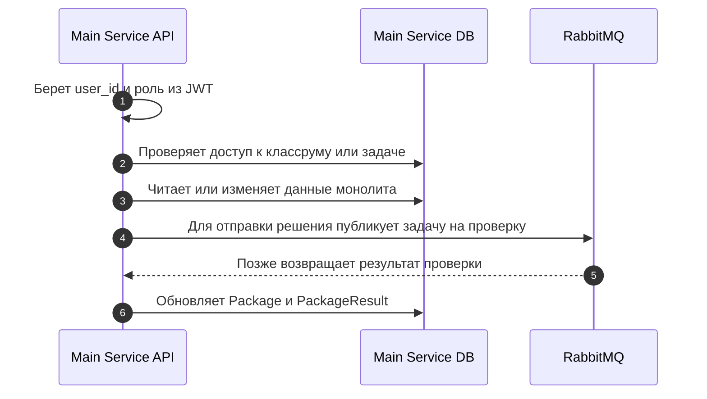

## Работа с данными по ручкам

### `GET /api/classrooms`

Получение списка классрумов.

Схема:

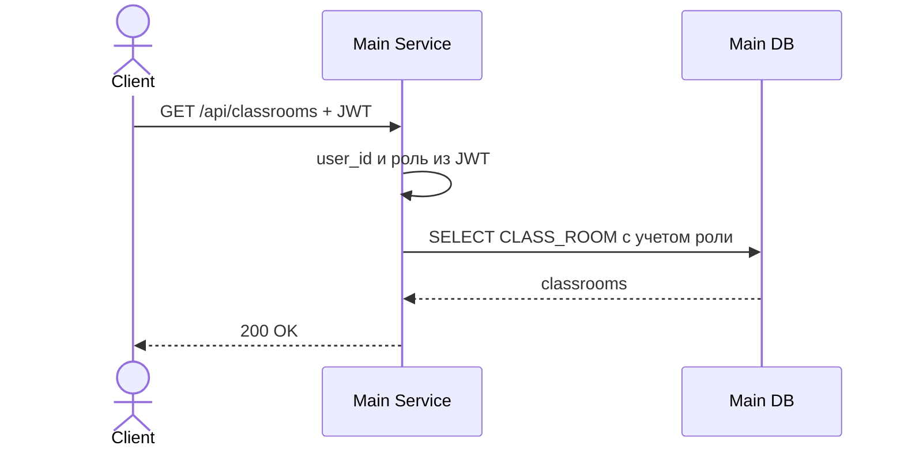

Данные:

| Шаг | Работа с данными |
| --- | --- |
| Проверка | Из JWT берется `user_id` и роль. |
| Чтение | `Admin` читает все активные `CLASS_ROOM`; остальные пользователи читают только классрумы через `USER_CLASS_ROOM`. |
| Запись | Нет. |
| Ответ | Список классрумов без удаленных записей `is_deleted = true`. |

### `POST /api/classrooms`

Создание классрума.

Схема:

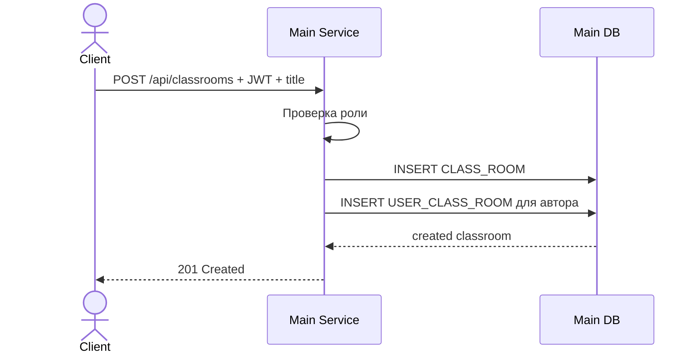

Данные:

| Шаг | Работа с данными |
| --- | --- |
| Проверка | Требуется роль `Admin`, `Teacher` или `Assistant` по правилам системы. |
| Чтение | Проверяются данные из JWT, пользователь в БД монолита не ищется. |
| Запись | Создается `CLASS_ROOM`; автор добавляется в `USER_CLASS_ROOM` с ролью `Teacher` или `Assistant`. |
| Ответ | Созданный классрум. |

### `GET /api/classrooms/{id}`

Получение одного классрума.

Схема:

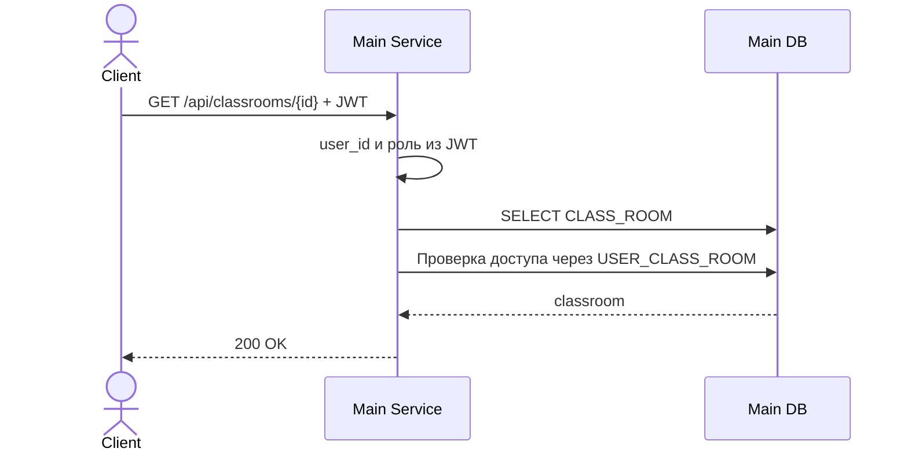

Данные:

| Шаг | Работа с данными |
| --- | --- |
| Проверка | Пользователь должен быть `Admin` или участником этого классрума. |
| Чтение | `CLASS_ROOM` и при необходимости `USER_CLASS_ROOM`. |
| Запись | Нет. |
| Ответ | Данные классрума. |

### `PUT /api/classrooms/{id}`

Редактирование классрума.

Схема:

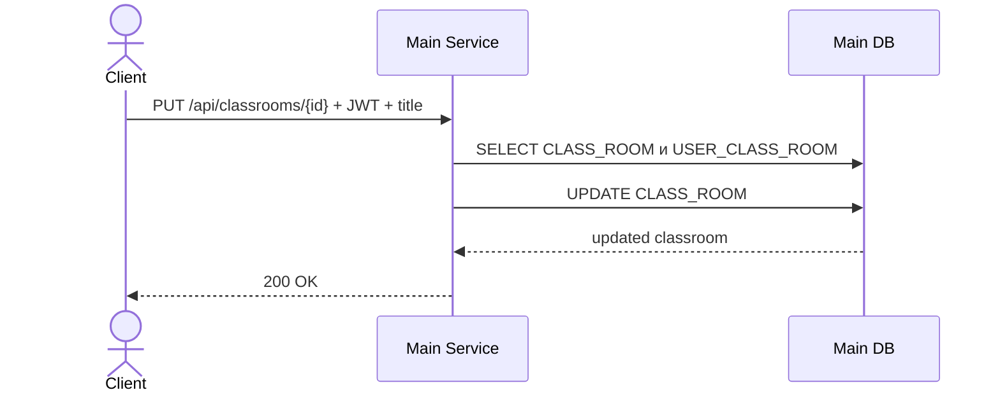

Данные:

| Шаг | Работа с данными |
| --- | --- |
| Проверка | `Admin`, `Teacher` или `Assistant` с правами на этот классрум. |
| Чтение | `CLASS_ROOM`, `USER_CLASS_ROOM`. |
| Запись | Обновляются поля `CLASS_ROOM.title`, `updated_at`. |
| Ответ | Обновленный классрум. |

### `PATCH /api/classrooms/{id}`

Частичное редактирование классрума.

Схема:

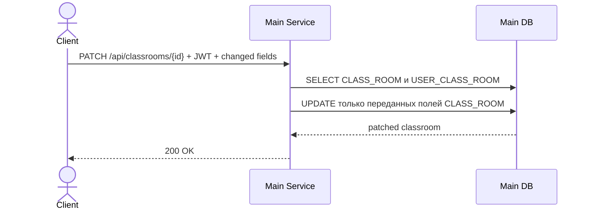

Данные:

| Шаг | Работа с данными |
| --- | --- |
| Проверка | `Admin`, `Teacher` или `Assistant` с правами на этот классрум. |
| Чтение | `CLASS_ROOM`, `USER_CLASS_ROOM`. |
| Запись | Обновляются только переданные поля, например `title`; `updated_at` обновляется всегда. |
| Ответ | Обновленный классрум. |

### `DELETE /api/classrooms/{id}`

Мягкое удаление классрума.

Схема:

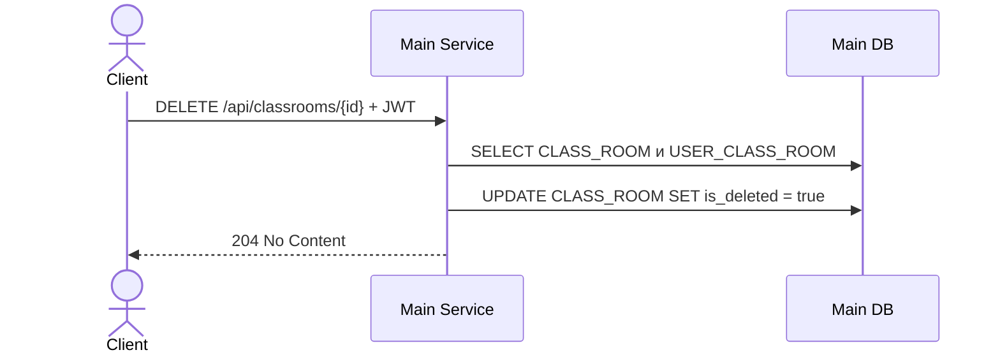

Данные:

| Шаг | Работа с данными |
| --- | --- |
| Проверка | `Admin` или владелец/преподаватель классрума. |
| Чтение | `CLASS_ROOM`, `USER_CLASS_ROOM`. |
| Запись | `CLASS_ROOM.is_deleted = true`, `updated_at = now`. |
| Ответ | Успешное удаление без физического удаления задач и отправок. |

### `GET /api/classrooms/{classroomId}/tasks`

Получение задач классрума.

Схема:

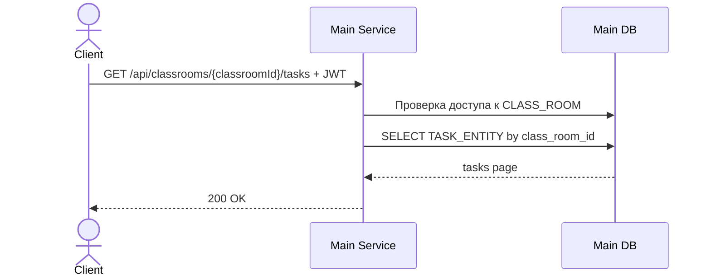

Данные:

| Шаг | Работа с данными |
| --- | --- |
| Проверка | Пользователь должен иметь доступ к классруму. |
| Чтение | `TASK_ENTITY` по `class_room_id`; тесты не возвращаются в списке. |
| Запись | Нет. |
| Ответ | Пагинированный список задач. |

### `POST /api/classrooms/{classroomId}/tasks`

Создание задачи.

Схема:

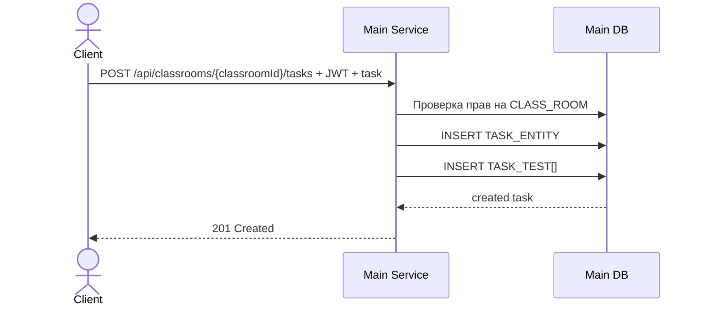

Данные:

| Шаг | Работа с данными |
| --- | --- |
| Проверка | `Admin`, `Teacher` или `Assistant` с правами на классрум. |
| Чтение | `CLASS_ROOM`, `USER_CLASS_ROOM`. |
| Запись | В транзакции создаются `TASK_ENTITY` и связанные `TASK_TEST`. |
| Ответ | Созданная задача. |

Тесты передаются массивом и сохраняются отдельными строками:

```json
[
  {
    "in": "2 2",
    "out": "4",
    "isHidden": false
  }
]
```

### `GET /api/classrooms/{classroomId}/tasks/{taskId}`

Получение задачи.

Схема:

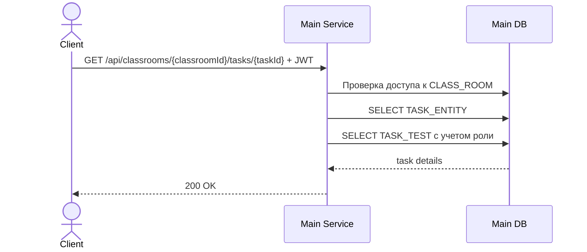

Данные:

| Шаг | Работа с данными |
| --- | --- |
| Проверка | Пользователь должен иметь доступ к классруму. |
| Чтение | `TASK_ENTITY`; для студентов скрытые тесты не возвращаются. |
| Запись | Нет. |
| Ответ | Описание задачи, примеры, открытые тесты или тесты целиком для ролей с правом редактирования. |

### `PUT /api/classrooms/{classroomId}/tasks/{taskId}`

Редактирование задачи.

Схема:

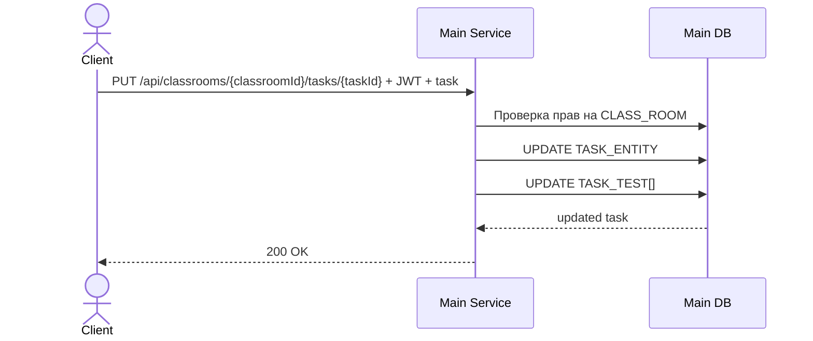

Данные:

| Шаг | Работа с данными |
| --- | --- |
| Проверка | `Admin`, `Teacher` или `Assistant` с правами на классрум. |
| Чтение | `TASK_ENTITY`, `TASK_TEST`, `USER_CLASS_ROOM`. |
| Запись | В транзакции обновляется `TASK_ENTITY` и набор `TASK_TEST`. |
| Ответ | Обновленная задача. |

История уже отправленных решений не пересчитывается автоматически.
Она остается связанной с тем состоянием задачи и тестов, которое было на момент проверки.

### `PATCH /api/classrooms/{classroomId}/tasks/{taskId}`

Частичное редактирование задачи.

Схема:

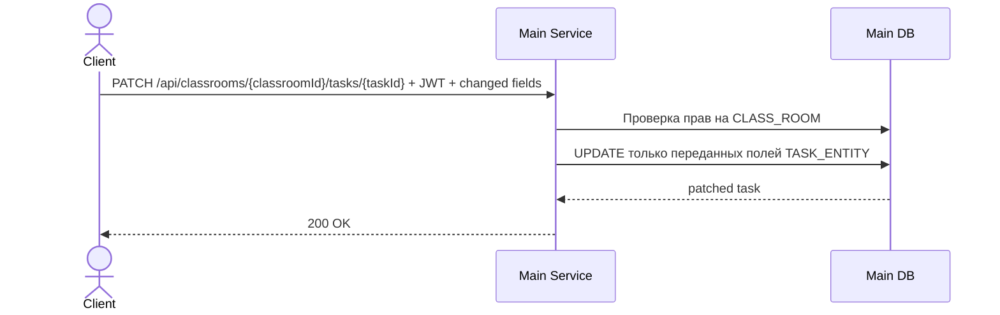

Данные:

| Шаг | Работа с данными |
| --- | --- |
| Проверка | `Admin`, `Teacher` или `Assistant` с правами на классрум. |
| Чтение | `TASK_ENTITY`, `USER_CLASS_ROOM`. |
| Запись | Обновляются только переданные поля задачи: `title`, `description`, `input_sample`, `output_sample`; `updated_at` обновляется всегда. |
| Ответ | Обновленная задача. |

### `POST /api/classrooms/{classroomId}/tasks/{taskId}/tests/upload`

Загрузка тестов задачи из файла.

Схема:

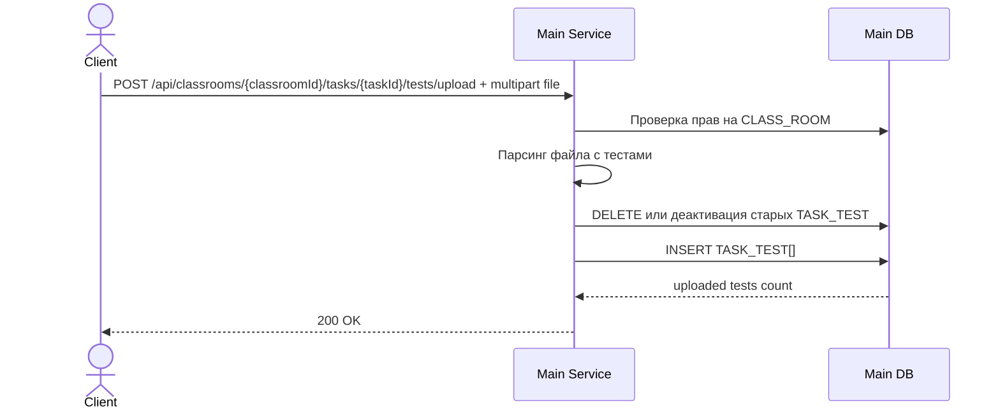

Данные:

| Шаг | Работа с данными |
| --- | --- |
| Проверка | `Admin`, `Teacher` или `Assistant` с правами на классрум. |
| Вход | `multipart/form-data`, поле `file`; поддерживаемый формат: JSON-файл с массивом тестов. |
| Чтение | `TASK_ENTITY`, `USER_CLASS_ROOM`. |
| Запись | В транзакции старый набор `TASK_TEST` заменяется новым набором из файла. |
| Ответ | Количество загруженных тестов и `taskId`. |

Пример содержимого файла:

```json
[
  {
    "in": "2 2",
    "out": "4",
    "isHidden": false
  },
  {
    "in": "10 15",
    "out": "25",
    "isHidden": true
  }
]
```

### `DELETE /api/classrooms/{classroomId}/tasks/{taskId}`

Мягкое удаление задачи.

Схема:

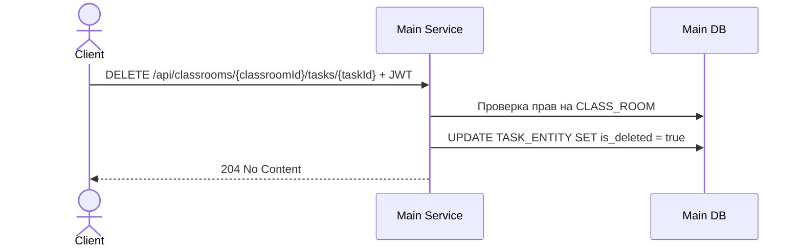

Данные:

| Шаг | Работа с данными |
| --- | --- |
| Проверка | `Admin`, `Teacher` или `Assistant` с правами на классрум. |
| Чтение | `TASK_ENTITY`, `USER_CLASS_ROOM`. |
| Запись | `TASK_ENTITY.is_deleted = true`, `updated_at = now`. |
| Ответ | Успешное удаление без физического удаления отправок. |

### `POST /api/tasks/{taskId}/submissions`

Отправка решения на проверку.

Схема:

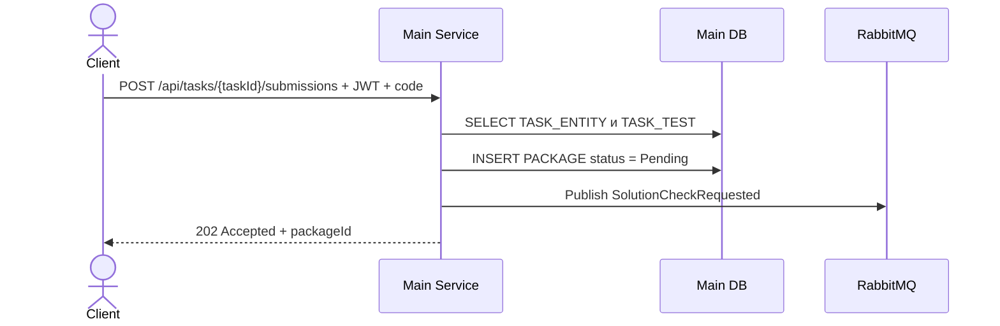

Данные:

| Шаг | Работа с данными |
| --- | --- |
| Проверка | Пользователь должен иметь доступ к задаче через классрум. |
| Чтение | `TASK_ENTITY`, `TASK_TEST`, `USER_CLASS_ROOM`. |
| Запись | Создается `PACKAGE` со статусом `Pending`, языком, кодом, `task_id`, `user_id`, `correlation_id`. |
| Очередь | В RabbitMQ публикуется `SolutionCheckRequested`. |
| Ответ | `202 Accepted` и `packageId`. |

Сообщение в RabbitMQ содержит данные, необходимые для проверки:

```json
{
  "packageId": "9a0b7f2d-7d88-4a6c-9f2f-1d6e2b3e1c01",
  "taskId": "0a50e98b-3f2f-40c1-83c6-4f8b1e3e51e2",
  "userId": "4d9c9656-8a58-41f5-8df6-691a6f61f1b5",
  "language": "csharp",
  "code": "source code",
  "tests": [
    {
      "input": "2 2",
      "expectedOutput": "4"
    }
  ],
  "createdAt": "2026-05-30T00:00:00Z"
}
```

Имя события: `SolutionCheckRequested`.
Очередь: `solution.check`.

### `RabbitMQ: SolutionCheckCompleted`

Обработка результата проверки. Это не HTTP-ручка, но это входной канал данных для монолита.

Схема:

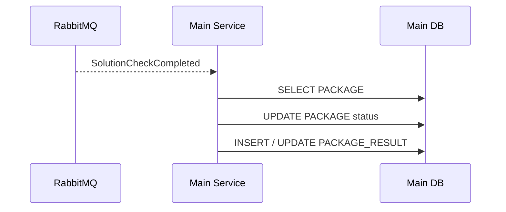

Данные:

| Шаг | Работа с данными |
| --- | --- |
| Проверка | Сообщение сопоставляется с `PACKAGE` по `packageId` или `correlationId`. |
| Чтение | `PACKAGE`. |
| Запись | Обновляется `PACKAGE.status`; создается или обновляется `PACKAGE_RESULT`. |
| Идемпотентность | Повторное сообщение не должно создавать дубликат результата. |

```json
{
  "packageId": "9a0b7f2d-7d88-4a6c-9f2f-1d6e2b3e1c01",
  "status": "Rejected",
  "passedTests": 8,
  "failedTests": 2,
  "output": "short output",
  "error": null,
  "executionTimeMs": 120,
  "memoryKb": 32768,
  "checkedAt": "2026-05-30T00:00:03Z"
}
```

Если код не скомпилировался или выполнение завершилось ошибкой, `status` может быть `CompilationError` или `RuntimeError`, а поле `error` содержит диагностическое сообщение.

### `GET /api/submissions`

Получение истории отправок.

Схема:

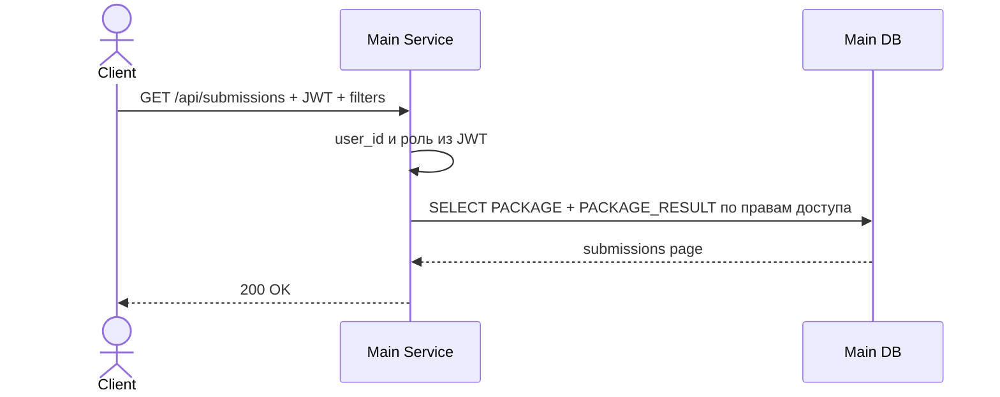

Данные:

| Шаг | Работа с данными |
| --- | --- |
| Проверка | Обычный пользователь видит только свои отправки; `Admin` видит все; `Teacher` и `Assistant` видят отправки по своим классрумам. |
| Чтение | `PACKAGE`, `PACKAGE_RESULT`, `TASK_ENTITY`, `CLASS_ROOM`. |
| Запись | Нет. |
| Ответ | Пагинированная история отправок с результатами проверки. |

### `GET /api/submissions/{packageId}`

Получение одной отправки.

Схема:

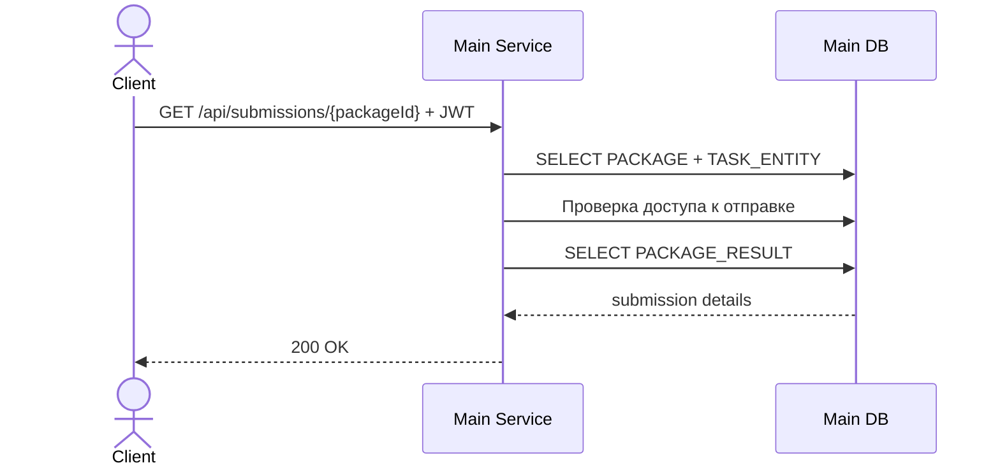

Данные:

| Шаг | Работа с данными |
| --- | --- |
| Проверка | Пользователь является автором отправки или имеет права на классрум задачи. |
| Чтение | `PACKAGE`, `PACKAGE_RESULT`, `TASK_ENTITY`, `CLASS_ROOM`. |
| Запись | Нет. |
| Ответ | Код, язык, статус, количество пройденных и непройденных тестов, ошибка проверки при наличии. |

### `GET /api/tasks/{taskId}/submissions`

Получение отправок по задаче.

Схема:

```mermaid
sequenceDiagram
    actor Client
    participant Main as Main Service
    participant Db as Main DB
    Client->>Main: GET /api/tasks/{taskId}/submissions + JWT
    Main->>Db: SELECT TASK_ENTITY
    Main->>Db: Проверка прав на CLASS_ROOM задачи
    Main->>Db: SELECT PACKAGE + PACKAGE_RESULT by task_id
    Db-->>Main: submissions page
    Main-->>Client: 200 OK
```

Данные:

| Шаг | Работа с данными |
| --- | --- |
| Проверка | Доступно `Admin`, `Teacher`, `Assistant` с правами на классрум задачи. |
| Чтение | `PACKAGE`, `PACKAGE_RESULT`, `TASK_ENTITY`. |
| Запись | Нет. |
| Ответ | Пагинированный список отправок по задаче. |

## Статусы отправки

```mermaid
stateDiagram-v2
    [*] --> Pending: решение принято
    Pending --> Running: воркер начал проверку
    Running --> Accepted: все тесты пройдены
    Running --> Rejected: есть непройденные тесты
    Running --> CompilationError: ошибка компиляции
    Running --> RuntimeError: ошибка выполнения
    Pending --> InfrastructureError: ошибка отправки или подготовки
    Accepted --> [*]
    Rejected --> [*]
    CompilationError --> [*]
    RuntimeError --> [*]
    InfrastructureError --> [*]
```

| Статус | Значение |
| --- | --- |
| `Pending` | Решение сохранено и ожидает проверки. |
| `Running` | Воркер начал выполнение кода. |
| `Accepted` | Проверка завершена, все тесты пройдены. |
| `Rejected` | Проверка завершена, часть тестов не пройдена. |
| `CompilationError` | Проверка завершена ошибкой компиляции. |
| `RuntimeError` | Проверка завершена ошибкой выполнения. |
| `InfrastructureError` | Проверка не выполнена из-за ошибки инфраструктуры. |

## Эндпоинты для реализации

Перечисленные ниже endpoint-ы являются обязательной частью `Main Service`.
Именно их нужно реализовать в монолите для работы с классрумами, задачами, тестами и отправками решений.
OpenAPI-спецификация этих endpoint-ов находится в [main-service.openapi.yaml](main-service.openapi.yaml).

### Classrooms

| Метод | URL | Роль | Назначение |
| --- | --- | --- | --- |
| `GET` | `/api/classrooms` | `User` | Получить список доступных классрумов. |
| `POST` | `/api/classrooms` | `Admin`, `Assistant` | Создать классрум. |
| `GET` | `/api/classrooms/{id}` | `User` | Получить классрум. |
| `PUT` | `/api/classrooms/{id}` | `Admin`, `Assistant` | Обновить классрум. |
| `PATCH` | `/api/classrooms/{id}` | `Admin`, `Assistant` | Частично обновить классрум. |
| `DELETE` | `/api/classrooms/{id}` | `Admin`, `Assistant` | Мягко удалить классрум. |

### Tasks

| Метод | URL | Роль | Назначение |
| --- | --- | --- | --- |
| `GET` | `/api/classrooms/{classroomId}/tasks` | `User` | Получить задачи классрума. |
| `POST` | `/api/classrooms/{classroomId}/tasks` | `Admin`, `Assistant` | Создать задачу. |
| `GET` | `/api/classrooms/{classroomId}/tasks/{taskId}` | `User` | Получить задачу. |
| `PUT` | `/api/classrooms/{classroomId}/tasks/{taskId}` | `Admin`, `Assistant` | Обновить задачу и тесты. |
| `PATCH` | `/api/classrooms/{classroomId}/tasks/{taskId}` | `Admin`, `Assistant` | Частично обновить задачу. |
| `POST` | `/api/classrooms/{classroomId}/tasks/{taskId}/tests/upload` | `Admin`, `Assistant` | Загрузить тесты из файла. |
| `DELETE` | `/api/classrooms/{classroomId}/tasks/{taskId}` | `Admin`, `Assistant` | Мягко удалить задачу. |

### Packages / Submissions

| Метод | URL | Роль | Назначение |
| --- | --- | --- | --- |
| `POST` | `/api/tasks/{taskId}/submissions` | `User` | Отправить код решения на проверку. |
| `GET` | `/api/submissions` | `User` | Получить историю отправок. |
| `GET` | `/api/submissions/{packageId}` | `User` | Получить конкретную отправку и результат. |
| `GET` | `/api/tasks/{taskId}/submissions` | `Admin`, `Assistant` | Получить отправки по задаче. |

## Транзакции и согласованность

Критичные операции выполняются в транзакциях PostgreSQL:

- создание классрума и добавление автора в участники;
- создание задачи и набора тестов;
- обновление задачи и тестов;
- создание отправки перед публикацией сообщения;
- сохранение результата проверки.

При отправке решения возможна ситуация, когда запись `PACKAGE` создана, но сообщение в RabbitMQ не опубликовано.
Для надежной реализации рекомендуется использовать паттерн Outbox:

1. В одной транзакции создать `PACKAGE` и запись `OUTBOX_MESSAGE`.
2. Отдельный фоновый процесс публикует сообщения из `OUTBOX_MESSAGE` в RabbitMQ.
3. После успешной публикации сообщение помечается как отправленное.

Это защищает систему от потери отправок при сбоях между записью в базу и публикацией в очередь.

## Наблюдаемость

`Main Service` должен отдавать метрики для Prometheus:

- количество созданных отправок;
- количество отправок в статусах `Pending`, `Running`, `Accepted`, `Rejected`, `CompilationError`, `RuntimeError`, `InfrastructureError`;
- время обработки API-запросов;
- количество ошибок публикации в RabbitMQ;
- количество полученных результатов проверки;
- задержка между созданием отправки и получением результата.

Эти метрики отображаются в Grafana и помогают отслеживать нагрузку, ошибки воркеров и задержки проверки.
