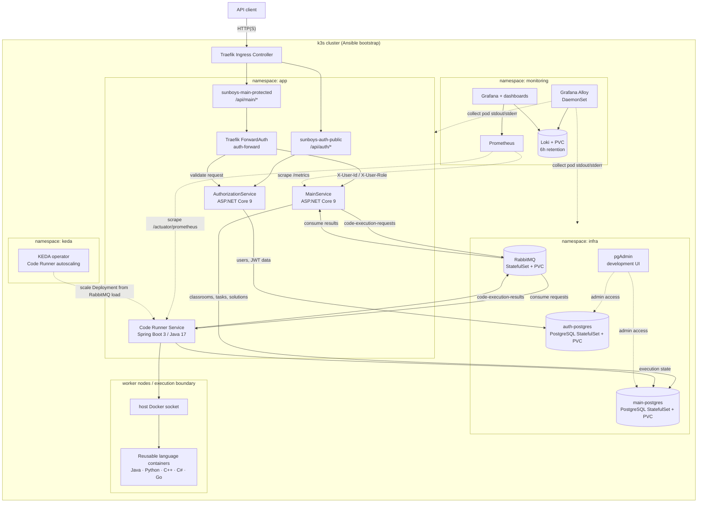
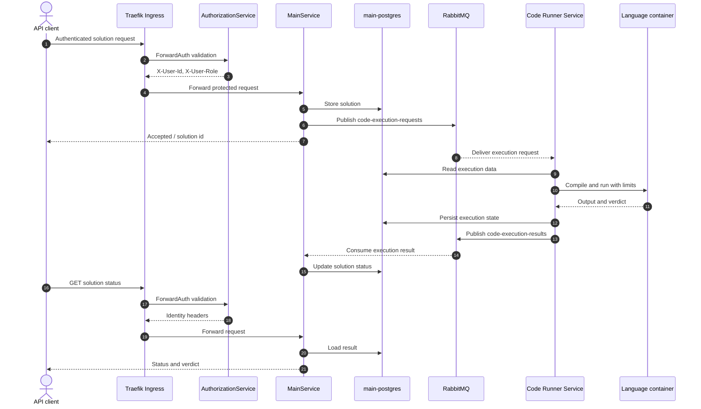

# SRE Architecture Specification

Документ описывает инфраструктурную архитектуру системы автопроверки решений студентов SUNBOYS. Целевая платформа: Kubernetes, .NET микросервисы, RabbitMQ, PostgreSQL, Prometheus, Grafana, Loki, Promtail и GitHub Pages для документации.

## 1. Общая Архитектура

Система строится как набор независимых .NET микросервисов, развернутых в Kubernetes. Внешний трафик принимает Nginx Ingress, внутреннее взаимодействие выполняется через Kubernetes Services и RabbitMQ. Синхронные API-запросы используются для пользовательских сценариев и чтения данных, асинхронные события используются для проверки решений, уведомлений и фоновой обработки.

### Архитектурный Подход

| Слой | Ответственность |
| --- | --- |
| Edge | TLS termination, маршрутизация HTTP(S), базовые лимиты и защита публичных API. |
| API services | Бизнес-логика, авторизация, управление аудиториями, задачами и отправками решений. |
| Async processing | Очереди RabbitMQ, retry, DLQ, worker pool для проверки решений. |
| Data layer | PostgreSQL, миграции, backup/restore, connection pooling. |
| Observability | Метрики, дашборды, алерты, централизованные JSON-логи, correlationId. |
| Execution isolation | Изолированный запуск пользовательского кода с лимитами CPU, памяти, времени и файловой системы. |
| Delivery | CI/CD pipeline, сборка образов, сканирование, деплой и rollback. |

### Назначение Сервисов

| Сервис | Назначение | Внешний доступ |
| --- | --- | --- |
| `frontend` | Веб-интерфейс студента и преподавателя. | Да |
| `auth-service` | Пользователи, роли, JWT/OIDC, проверка токенов. | Да, только публичные auth endpoints |
| `classrooms-service` | Аудитории, группы, членство, роли преподавателей. | Через gateway |
| `task-service` | Задачи, тестовые наборы, лимиты, условия. | Через gateway |
| `package-service` | Прием решений, создание submission, публикация события в RabbitMQ. | Через gateway |
| `run-worker` | Получение задач из очереди, запуск кода, выполнение тестов, публикация результата. | Нет |
| `notification-service` | Уведомления о статусах, email/websocket/push integrations. | Нет или только внутренний API |

### Взаимодействие Сервисов

`frontend` обращается к публичным API через Ingress. Сервисы валидируют JWT через `auth-service` или локальную проверку подписи JWKS. `package-service` создает запись submission в PostgreSQL и публикует сообщение `submission.check.requested`. `run-worker` потребляет сообщение, запускает проверку в sandbox, сохраняет результат и публикует `submission.check.completed` или `submission.check.failed`. `notification-service` отправляет уведомления пользователям и преподавателям.

## 2. Архитектурная Диаграмма



## 3. Поток Проверки Решения



## 4. Kubernetes

### Namespace Strategy

| Namespace | Назначение |
| --- | --- |
| `autocheck-dev` | Dev-окружение, быстрая интеграционная проверка. |
| `autocheck-stage` | Pre-production, smoke/regression проверки перед релизом. |
| `autocheck-prod` | Production workloads. |
| `autocheck-infra` | RabbitMQ, PostgreSQL, ingress controllers, cert-manager при необходимости. |
| `monitoring` | Prometheus, Grafana, exporters, alertmanager. |
| `logging` | Loki, Promtail, log retention policies. |
| `ci-cd` | GitHub/GitLab runners, deployment automation, registry helpers. |

### Workload Types

| Компонент | Kubernetes object | Масштабирование |
| --- | --- | --- |
| API services | `Deployment` + `Service` | HPA по CPU, memory, RPS, latency. |
| `frontend` | `Deployment` + `Service` | HPA по CPU/RPS. |
| `run-worker` | `Deployment` | KEDA/HPA по глубине очереди RabbitMQ. |
| RabbitMQ | `StatefulSet` или operator | PV, anti-affinity, quorum queues. |
| PostgreSQL | Managed DB предпочтительно; иначе operator/StatefulSet | PV, backup sidecar/operator. |
| Prometheus/Loki | Helm chart/operator | PV для retention. |

### Deployments And Services

Каждый микросервис должен иметь отдельный `Deployment`, `Service`, `ConfigMap`, `Secret`, `ServiceAccount`, `PodDisruptionBudget` и `HorizontalPodAutoscaler`. Контейнеры публикуют `/health/live`, `/health/ready` и `/metrics`.

```yaml
apiVersion: apps/v1
kind: Deployment
metadata:
  name: package-service
  namespace: autocheck-prod
spec:
  replicas: 3
  selector:
    matchLabels:
      app: package-service
  template:
    metadata:
      labels:
        app: package-service
    spec:
      serviceAccountName: package-service
      containers:
        - name: package-service
          image: registry.example.com/autocheck/package-service:1.0.0
          ports:
            - containerPort: 8080
          envFrom:
            - configMapRef:
                name: package-service-config
            - secretRef:
                name: package-service-secrets
          readinessProbe:
            httpGet:
              path: /health/ready
              port: 8080
          livenessProbe:
            httpGet:
              path: /health/live
              port: 8080
          resources:
            requests:
              cpu: 250m
              memory: 256Mi
            limits:
              cpu: "1"
              memory: 512Mi
```

### ConfigMaps And Secrets

`ConfigMap` хранит не чувствительные настройки: URL внутренних сервисов, feature flags, queue names, log level. `Secret` хранит DSN, пароли RabbitMQ/PostgreSQL, signing keys, SMTP credentials. Секреты должны поставляться через sealed-secrets, External Secrets Operator или cloud secret manager.

### Autoscaling

API-сервисы масштабируются по CPU, memory и кастомным метрикам: RPS, p95 latency, количество активных запросов. `run-worker` масштабируется по `rabbitmq_queue_messages_ready` и ограничивается квотами namespace, чтобы всплеск проверок не вытеснил API.

```yaml
apiVersion: autoscaling/v2
kind: HorizontalPodAutoscaler
metadata:
  name: run-worker
  namespace: autocheck-prod
spec:
  scaleTargetRef:
    apiVersion: apps/v1
    kind: Deployment
    name: run-worker
  minReplicas: 2
  maxReplicas: 30
  metrics:
    - type: Resource
      resource:
        name: cpu
        target:
          type: Utilization
          averageUtilization: 70
```

### Persistent Volumes

PostgreSQL, RabbitMQ, Prometheus, Grafana и Loki используют `PersistentVolumeClaim`. Для `run-worker` постоянное хранилище не используется; временные файлы решения размещаются в `emptyDir` с `sizeLimit` и удаляются после проверки.

### Service Accounts

Каждый сервис получает отдельный `ServiceAccount` с минимальными RBAC-правами. API-сервисы не должны иметь доступ к Kubernetes API, если это не требуется. `run-worker` не должен иметь права создавать privileged pods или читать secrets других сервисов.

## 5. Маршрутизация

### Внешние Маршруты

| Route | Target | Комментарий |
| --- | --- | --- |
| `/` | `frontend` | SPA/static UI. |
| `/api/auth/*` | `auth-service` | Login, refresh, logout, JWKS public endpoint. |
| `/api/classrooms/*` | `classrooms-service` | Только авторизованный доступ. |
| `/api/tasks/*` | `task-service` | CRUD задач, выдача условий. |
| `/api/submissions/*` | `package-service` | Прием решений и получение статусов. |

### Внутренние Вызовы

Внутренние обращения используют DNS Kubernetes: `http://task-service.autocheck-prod.svc.cluster.local:8080`. Межсервисная авторизация выполняется через service-to-service JWT, mTLS service mesh или network policies плюс short-lived credentials.

### Ingress Rules

```yaml
apiVersion: networking.k8s.io/v1
kind: Ingress
metadata:
  name: autocheck
  namespace: autocheck-prod
  annotations:
    nginx.ingress.kubernetes.io/proxy-body-size: "20m"
    nginx.ingress.kubernetes.io/limit-rps: "20"
spec:
  ingressClassName: nginx
  tls:
    - hosts:
        - autocheck.example.com
      secretName: autocheck-tls
  rules:
    - host: autocheck.example.com
      http:
        paths:
          - path: /
            pathType: Prefix
            backend:
              service:
                name: frontend
                port:
                  number: 80
          - path: /api/submissions
            pathType: Prefix
            backend:
              service:
                name: package-service
                port:
                  number: 8080
```

### Закрыто Извне

RabbitMQ management UI, PostgreSQL, Prometheus scrape endpoints, Loki, internal worker API, admin/debug endpoints и Kubernetes dashboards не публикуются через публичный Ingress. Доступ только через VPN, bastion, port-forward с audit trail или private ingress.

## 6. RabbitMQ

### Exchanges

| Exchange | Type | Назначение |
| --- | --- | --- |
| `submission.exchange` | topic | События жизненного цикла проверки решений. |
| `notification.exchange` | direct | Доставка событий уведомлений. |
| `submission.dlx` | direct | Dead-letter routing. |

### Queues And Routing Keys

| Queue | Routing key | Producer | Consumer |
| --- | --- | --- | --- |
| `submission.check.requested` | `submission.check.requested` | `package-service` | `run-worker` |
| `submission.check.completed` | `submission.check.completed` | `run-worker` | `notification-service`, `package-service` projection consumer |
| `submission.check.failed` | `submission.check.failed` | `run-worker` | `notification-service`, support tooling |
| `notifications.queue` | `notification.*` | API services | `notification-service` |
| `submission.check.dlq` | `submission.check.dlq` | RabbitMQ DLX | Ops/manual reprocessor |

### Retry And DLQ Policy

Повтор должен быть ограниченным и наблюдаемым. Рекомендуемая политика: 3 попытки с backoff 10s, 60s, 300s. После исчерпания попыток сообщение отправляется в `submission.check.dlq`, submission переводится в `InfrastructureError`, а пользователь получает корректный статус без потери запроса.

```yaml
rabbitmq:
  queues:
    submission.check.requested:
      durable: true
      arguments:
        x-dead-letter-exchange: submission.dlx
        x-dead-letter-routing-key: submission.check.dlq
        x-queue-type: quorum
```

### Message Example

```json
{
  "messageId": "01JZ4QMR7G3WWZCJH1JYTR9Y8Y",
  "correlationId": "01JZ4QMR6VEQ7P9RXWVK7YRT3P",
  "eventType": "submission.check.requested",
  "occurredAt": "2026-05-25T15:00:00Z",
  "submissionId": "sub_12345",
  "taskId": "task_42",
  "userId": "user_1001",
  "language": "csharp",
  "sourceObjectKey": "submissions/sub_12345/source.zip",
  "limits": {
    "cpuMs": 2000,
    "memoryMb": 256,
    "wallTimeMs": 5000
  },
  "attempt": 1
}
```

### Idempotency

`messageId` уникален для сообщения, `submissionId` является бизнес-ключом идемпотентности. `run-worker` должен проверять текущий статус submission перед запуском и не выполнять повторно уже завершенную проверку. Запись результата должна быть атомарной: переход `Running -> Completed/Failed` выполняется условным update по текущему статусу и версии записи.

## 7. PostgreSQL

### Data Zones

| Зона | Примеры данных | Владение |
| --- | --- | --- |
| Identity | users, roles, sessions, refresh tokens | `auth-service` |
| Education | classrooms, groups, memberships | `classrooms-service` |
| Tasks | tasks, test metadata, limits, tags | `task-service` |
| Submissions | submissions, verdicts, execution metrics | `package-service` |
| Notifications | notification preferences, delivery state | `notification-service` |
| Audit | audit events, security events | Shared append-only schema |

Для строгой изоляции предпочтительна модель database-per-service. Если используется общий PostgreSQL cluster, каждый сервис получает отдельную database/schema и отдельного пользователя с минимальными правами.

### Migrations

Миграции выполняются в CI/CD перед rollout приложения или как отдельный Kubernetes Job. Для .NET рекомендуется EF Core migrations или DbUp. Миграции должны быть backward-compatible: сначала расширение схемы, затем деплой кода, затем удаление старых колонок отдельным релизом.

### Backup And Restore

Production backup: daily full backup, WAL archiving, retention 30 дней, ежемесячные архивы 12 месяцев. Restore drill проводится минимум раз в квартал на отдельное окружение. RPO: 15 минут при WAL archiving. RTO: 60 минут для production.

### Connection Pooling

Использовать PgBouncer в transaction pooling mode либо встроенный пул Npgsql с жесткими лимитами. Каждый сервис получает лимит подключений, чтобы суммарно не превышать `max_connections` PostgreSQL. Для production рекомендуется PgBouncer перед PostgreSQL.

## 8. Мониторинг

### Prometheus

Сервисы публикуют `/metrics` в формате Prometheus. Метрики включают:

| Категория | Метрики |
| --- | --- |
| Service metrics | request count, request duration, error count, active requests, GC, thread pool, DB query duration. |
| Infra metrics | pod restarts, CPU/memory, node pressure, PV usage, RabbitMQ depth, PostgreSQL health. |
| RED metrics | Rate, Errors, Duration для каждого API endpoint и worker operation. |
| Queue metrics | messages ready, unacked, publish rate, consume rate, oldest message age. |

### Grafana

Минимальный набор dashboards:

| Dashboard | Содержимое |
| --- | --- |
| API Overview | RPS, p50/p95/p99 latency, 4xx/5xx, saturation. |
| Submission Pipeline | queue depth, wait time, run duration, verdict distribution, failures. |
| RabbitMQ | queue depth, consumers, publish/ack rates, DLQ. |
| PostgreSQL | connections, locks, slow queries, replication/WAL, storage. |
| Kubernetes | pods, restarts, resources, node pressure, HPA activity. |
| Logs Overview | error logs by service, correlationId search, top exceptions. |

### Alerts

| Alert | Условие | Severity | Реакция |
| --- | --- | --- | --- |
| `HighApiErrorRate` | 5xx > 2% за 10 минут | critical | Проверить rollout, dependencies, DB/RabbitMQ. |
| `ApiLatencyP95High` | p95 > 500 ms за 15 минут | warning | Проверить нагрузку, DB latency, autoscaling. |
| `SubmissionQueueBacklogHigh` | `submission.check.requested` > 1000 сообщений или oldest > 10 минут | critical | Увеличить workers, проверить sandbox/runtime failures. |
| `RunWorkerFailureRateHigh` | failed checks по infra reason > 5% за 10 минут | critical | Проверить runner images, Docker/sandbox, node pressure. |
| `RabbitMQDLQNotEmpty` | DLQ > 0 за 5 минут | warning | Разобрать сообщения и причину. |
| `PostgreSQLConnectionsHigh` | connections > 85% лимита за 10 минут | warning | Проверить пул, утечки, PgBouncer. |
| `PodCrashLooping` | restarts > 3 за 10 минут | critical | Откатить релиз или исправить конфигурацию. |
| `PersistentVolumeAlmostFull` | PV usage > 85% | warning | Расширить диск, очистить retention. |

## 9. Логирование

Loki хранит централизованные логи, Promtail собирает stdout/stderr контейнеров и добавляет Kubernetes labels: namespace, pod, container, app, version. Все сервисы пишут структурированные JSON-логи в stdout.

### Требования К Логам

| Поле | Назначение |
| --- | --- |
| `timestamp` | ISO 8601 UTC timestamp. |
| `level` | trace/debug/info/warn/error/fatal. |
| `service` | Имя сервиса. |
| `version` | Версия образа или git SHA. |
| `correlationId` | Сквозной ID запроса/сообщения. |
| `userId` | Только если применимо; без персональных данных сверх необходимости. |
| `submissionId` | Для операций проверки. |
| `message` | Краткое описание события. |
| `error.type`, `error.message`, `error.stack` | Для исключений. |

```json
{
  "timestamp": "2026-05-25T15:00:03.217Z",
  "level": "info",
  "service": "run-worker",
  "version": "1.0.0",
  "correlationId": "01JZ4QMR6VEQ7P9RXWVK7YRT3P",
  "submissionId": "sub_12345",
  "message": "Submission check completed",
  "durationMs": 1842,
  "verdict": "Accepted"
}
```

PII, access tokens, refresh tokens, passwords, source code студентов и полные тестовые данные не должны попадать в логи. Для исходного кода и артефактов использовать object storage с контролем доступа и retention.

## 10. Безопасность Запуска Кода

`run-worker` является самым рискованным компонентом. Пользовательский код должен выполняться в sandbox с изоляцией процессов, сети, файловой системы и ресурсов.

### Требования

| Контроль | Требование |
| --- | --- |
| Sandbox | Отдельный контейнер/процесс sandbox для каждой проверки; Firecracker/gVisor/Kata предпочтительнее Docker-out-of-Docker для production. |
| Network isolation | По умолчанию сеть отключена для пользовательского кода. Разрешены только внутренние операции runner, если они необходимы. |
| Non-root | Пользовательский код запускается не от root. |
| Seccomp | Использовать `RuntimeDefault` или более строгий профиль. |
| Resource limits | CPU, memory, process count, file size, open files, wall time. |
| Privileges | Запрещены privileged containers, hostPID, hostNetwork, hostPath для пользовательского кода. |
| Cleanup | После проверки удалять workspace, контейнеры, временные файлы и артефакты сверх retention. |
| Timeout | Жесткий wall-time timeout с принудительным завершением процесса. |
| Read-only filesystem | Root filesystem read-only, запись только в ограниченный `emptyDir`. |

### Security Context Example

```yaml
securityContext:
  runAsNonRoot: true
  runAsUser: 10001
  runAsGroup: 10001
  allowPrivilegeEscalation: false
  readOnlyRootFilesystem: true
  seccompProfile:
    type: RuntimeDefault
  capabilities:
    drop:
      - ALL
```

```yaml
apiVersion: v1
kind: Pod
metadata:
  name: sandbox-example
spec:
  automountServiceAccountToken: false
  restartPolicy: Never
  containers:
    - name: sandbox
      image: registry.example.com/autocheck/sandbox-dotnet:1.0.0
      command: ["/runner/execute"]
      securityContext:
        runAsNonRoot: true
        runAsUser: 10001
        allowPrivilegeEscalation: false
        readOnlyRootFilesystem: true
        seccompProfile:
          type: RuntimeDefault
        capabilities:
          drop: ["ALL"]
      resources:
        requests:
          cpu: 100m
          memory: 128Mi
        limits:
          cpu: "1"
          memory: 256Mi
      volumeMounts:
        - name: workspace
          mountPath: /workspace
  volumes:
    - name: workspace
      emptyDir:
        sizeLimit: 256Mi
```

## 11. CI/CD

Целевой delivery pipeline может быть реализован в GitLab CI/CD для приложения и GitHub Actions для публикации документации. Если код приложения хранится в GitLab, GitLab CI выполняет сборку, тестирование, сканирование, публикацию образов и деплой в Kubernetes.

### Pipeline

| Stage | Действия |
| --- | --- |
| Validate | lint, format check, unit tests, contract tests. |
| Build | docker build для каждого сервиса, immutable tag по commit SHA. |
| Scan | SAST, dependency scan, container image scan, secret scan. |
| Package | Helm chart/Kustomize render, policy validation. |
| Deploy dev | Автоматический деплой в `autocheck-dev`. |
| Deploy stage | Ручное подтверждение, миграции, smoke tests. |
| Deploy prod | Ручное подтверждение, canary/rolling update, post-deploy checks. |
| Rollback | Helm rollback или GitOps revert, откат миграций только если они backward-compatible. |

```yaml
stages:
  - validate
  - build
  - scan
  - deploy

build-package-service:
  stage: build
  script:
    - docker build -t "$CI_REGISTRY_IMAGE/package-service:$CI_COMMIT_SHA" services/package-service
    - docker push "$CI_REGISTRY_IMAGE/package-service:$CI_COMMIT_SHA"

deploy-stage:
  stage: deploy
  when: manual
  script:
    - helm upgrade --install autocheck charts/autocheck --namespace autocheck-stage --set image.tag=$CI_COMMIT_SHA
```

### Rollback

Rollback должен быть процедурой первого класса: хранить историю Helm releases, запрещать destructive migrations в одном релизе с кодом, иметь smoke tests после rollback и runbook для повторной обработки сообщений из DLQ.

## 12. SLO

| SLO | Цель | Измерение |
| --- | --- | --- |
| API availability | 99.9% monthly для публичных API | Успешные HTTP-запросы без 5xx. |
| API latency | p95 < 500 ms, p99 < 1500 ms | Prometheus histogram по endpoint. |
| Submission accepted latency | p95 < 1000 ms до `202 Accepted` | Время от POST до создания submission и публикации события. |
| Submission processing latency | p95 < 60 s для стандартных задач | Время от queued до final verdict. |
| Queue processing | oldest message age < 5 minutes 99% времени | RabbitMQ queue age metrics. |
| Worker availability | 99.5% monthly | Доля времени с доступными ready workers. |

Error budget используется для управления релизами. При превышении burn rate production-деплои замораживаются, кроме исправлений инцидентов.

## 13. Риски

| Риск | Меры |
| --- | --- |
| Побег из sandbox или доступ к host | Non-root, seccomp, no privileged, gVisor/Kata/Firecracker, network policies, отдельный node pool для workers. |
| Очередь проверок растет быстрее обработки | KEDA/HPA по RabbitMQ metrics, лимиты на submissions, приоритеты очередей, backpressure на API. |
| Потеря сообщений RabbitMQ | Durable quorum queues, publisher confirms, manual ack, idempotent consumers, DLQ. |
| Дублирующая проверка submission | Idempotency по `submissionId`, conditional updates, versioning, outbox pattern. |
| Перегрузка PostgreSQL | PgBouncer, индексы, лимиты подключений, slow query monitoring, read replicas для чтения при необходимости. |
| Утечка секретов | External Secrets, sealed-secrets, secret scanning, запрет логирования sensitive values. |
| Рост логов и стоимости хранения | Retention policies, sampling debug logs, structured labels без high-cardinality значений. |
| Необратимые миграции ломают rollback | Expand/contract migrations, backward-compatible releases, staging restore tests. |
| Worker вытесняет API workloads | Отдельный namespace/node pool, resource quotas, priority classes, pod anti-affinity. |
| Недостаточная наблюдаемость инцидентов | RED metrics, correlationId, dashboards, alert runbooks, регулярные incident reviews. |
